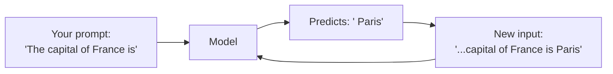
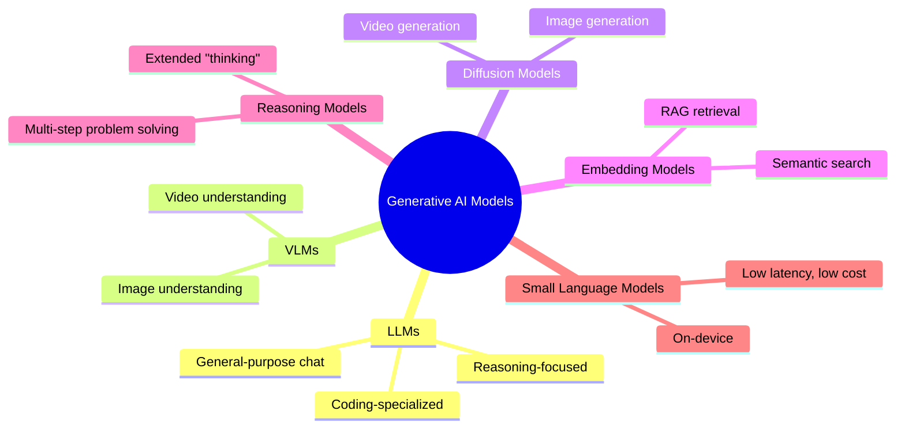

# Part I — Foundations of Generative AI 🟢

> **You'll leave this section knowing:** what a "model" actually is, the different families of models and what each is for, how to judge which model is right for a job, and a capability map you can refer back to for the rest of the repo.

---

## 1.1 A Mental Model First: What is a Model, Really?

Strip away the hype: a generative AI model is a very large function that has learned statistical patterns from huge amounts of data (text, images, audio, code) and uses those patterns to **predict the most plausible next piece of output**, given some input.

For a language model, that "next piece" is the next *token* (roughly, a word-fragment). It predicts one token, adds it to the input, predicts the next one, and repeats — that's it. Everything from a haiku to a working Python script is built one token at a time.

This simple loop is the foundation for *everything* in this repo — including agents, which are really just "the loop, plus the ability to call tools between predictions."

---

## 1.2 Types of Models Out There

Not all "AI models" do the same job. Here's the map:

| Type | What it does | Examples (2026) | Typical use |
|---|---|---|---|
| **LLM (Large Language Model)** | Predicts text token-by-token | Claude, GPT, Gemini, Llama | Chat, writing, coding, agents |
| **VLM (Vision-Language Model)** | Understands images/video *and* text together | Gemini, Claude (vision), GPT-4V | "What's in this photo?", document OCR |
| **Diffusion Model** | Generates images/video from noise, guided by a prompt | Midjourney, Stable Diffusion, Veo | Image/video generation |
| **Embedding Model** | Converts text into a vector of numbers capturing meaning | OpenAI text-embedding, Voyage, Gemini embeddings | Semantic search, RAG (Part V) |
| **Reasoning Model** | An LLM tuned to "think" longer before answering | Claude with extended thinking, o-series, Gemini Deep Think | Hard math, multi-step logic, planning |
| **SLM (Small Language Model)** | A compact LLM, often runs on-device | Phi, Gemma, SmolLM | Mobile apps, low-cost/low-latency tasks |

> 💡 **Beginner tip:** if you're building your first project, you almost always start with a general-purpose LLM (Claude, GPT, or Gemini) via API. You only reach for the other types once you have a specific need — search (embeddings), images (diffusion), or hard multi-step logic (reasoning models).

---

## 1.3 Best Models by Core Strength

Instead of asking "which model is #1?" (the answer changes monthly), ask: **"what is this model's core strength?"** Frontier labs increasingly differentiate on *core capability*, not just raw benchmark score.

| Core Strength | What to look for | Notable 2026 options |
|---|---|---|
| **Raw reasoning / hard problems** | Extended thinking, strong math & logic benchmarks | Claude (extended thinking), Gemini Deep Think, OpenAI reasoning models |
| **Coding & agentic tool-use** | Long-horizon task completion, reliable tool calling | Claude (Sonnet/Opus), GPT coding-tuned models |
| **Multimodal understanding** | Native image/video/audio input | Gemini, Claude, GPT-4V |
| **Agentic IDE / dev environments** | Built for autonomous, long-running coding sessions inside an IDE-like environment | **Google Antigravity** — Google's agentic development environment built around Gemini, designed for multi-step, tool-using coding workflows rather than single-turn chat |
| **Speed & cost efficiency** | Cheapest tokens, fastest latency | Smaller tier models (Haiku-class, Flash-class, mini-class) |
| **Open weights / self-hosting** | You can download and run it yourself | Llama, Qwen, DeepSeek, Mistral, Gemma *(full comparison in Part VI)* |

> ⚠️ **Don't chase leaderboards.** A model that's #1 on a general benchmark might be mediocre at the *specific* thing you need (e.g., long-context document analysis, or reliable structured output). Test on your actual task.

---

## 1.4 What Each Model Can Actually Do — Capability Matrix

A practical checklist for evaluating any model before you build on it:

| Capability | Ask this |
|---|---|
| Text generation | Can it write in the style/format I need? |
| Vision | Can it read screenshots, charts, scanned documents? |
| Tool/function calling | Can it reliably call external tools with correct arguments? |
| Structured output | Can it return valid JSON matching my schema, consistently? (Part IV) |
| Long context | How many tokens can it hold, and does quality degrade near the limit? |
| Extended reasoning | Can it "think longer" for hard problems, and can I control that? |
| Multilingual | Does it perform well in the languages I need? |
| Code execution / agentic use | Is it tuned for multi-step tool-using tasks, not just single answers? |

**Example — same question, different capability needs:**

> *"Summarize this 40-page PDF and extract every dollar figure into a JSON table."*

This single request actually needs: **vision or document parsing** (to read the PDF), **long context** (40 pages), and **structured output** (valid JSON) — three separate capabilities. A model that's excellent at creative writing but weak on structured output will *sound* right and still hand you broken JSON.

---

## 1.5 How LLMs Work, Without the Math (optional deep-dive)

If you want a little more intuition before moving on:

1. **Tokenization** — your text is split into tokens (roughly 4 characters/¾ of a word each). "AgentForge" might become `Agent` + `Forge`, or similar.
2. **Training** — the model is shown enormous amounts of text and learns to predict the next token, adjusting billions of internal parameters (weights) to get better at that prediction.
3. **Inference** — when you send a prompt, no more learning happens; the model just runs its learned prediction function forward, token by token (this is the loop from section 1.1).
4. **Context window** — the model can only "see" a limited number of tokens at once (your prompt + its own output so far). This limit is why context engineering (Part III) matters so much.

You don't need to know the underlying transformer architecture to build great things — but knowing this loop explains *why* models hallucinate (they're predicting plausible text, not looking up facts), why longer prompts cost more, and why "context window" is a real, hard constraint.

---

## ✅ Checkpoint — Before Moving to Part II

You should now be able to answer:
- [ ] What's the difference between an LLM, a VLM, and a diffusion model?
- [ ] Given a task, can you list which capabilities it actually requires?
- [ ] Why does a model sometimes state something false with total confidence? *(Preview of Part III.4 — hallucination)*

## 🛠️ Mini-Project
Pick any 3 models you have access to (e.g., via their chat apps). Give all three the exact same prompt that requires **reasoning + a structured list output**. Compare: which followed the format correctly? Which reasoned more carefully? Write down your findings — this is the beginning of your own model-evaluation instincts.

---

⬅️ [Back to main roadmap](../README.md) | ➡️ Next: [Part II — AI Engineering Fundamentals](../02-ai-engineering-fundamentals/README.md)
