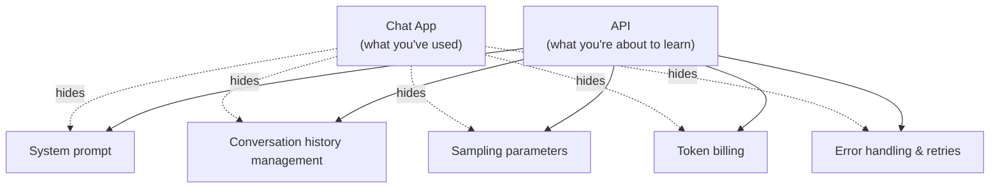
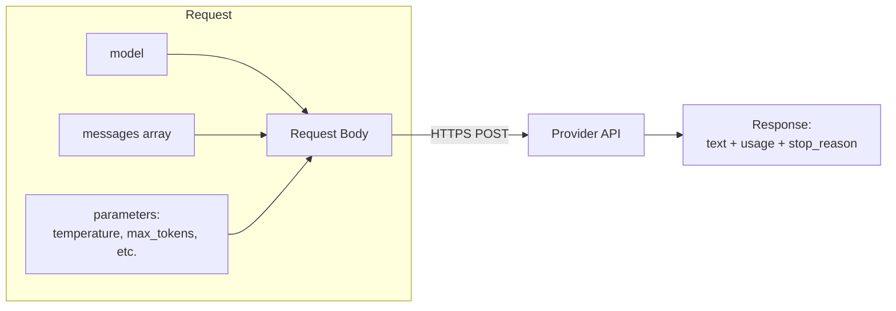
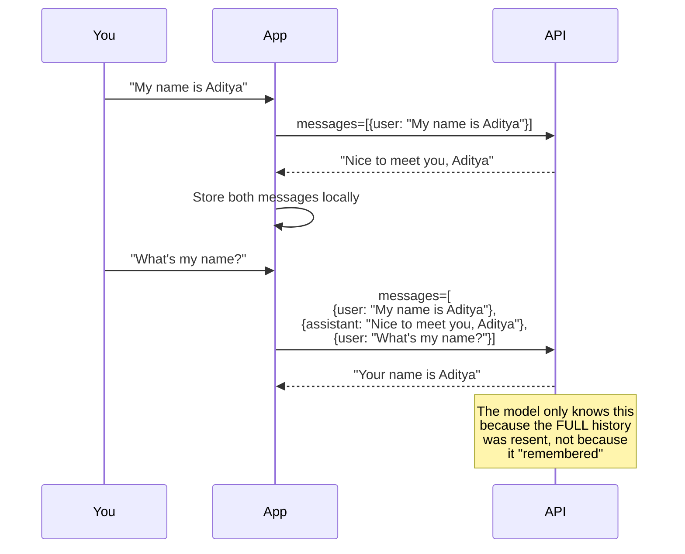
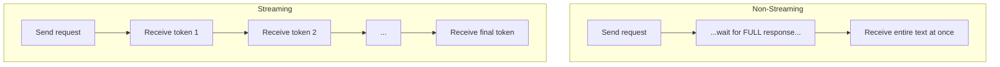
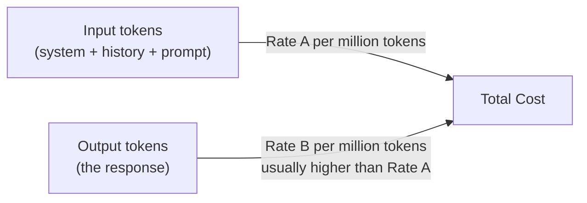
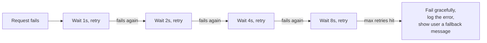

# Part II — AI Engineering Fundamentals 🟢

> **You'll leave this section knowing:** how to actually talk to a model via API (not just a chat box), the parameters that control its output, how billing and latency really work, and the engineering habits that separate a toy script from something you can build on.

---

## 2.1 From Chat Box to API: What Changes

Using ChatGPT/Claude/Gemini in a browser hides five things from you that matter the moment you write code:



Everything from here on assumes you're calling a model **programmatically** — this is the skill that unlocks agents, RAG, and every other part of this repo. If you can't make a reliable API call, you can't build anything past it.

---

## 2.2 Anatomy of an API Call

Every major provider (Anthropic, OpenAI, Google) uses the same shape, even though field names differ slightly. Strip away SDK sugar and it's just an HTTP POST with a JSON body:



**A minimal real call (Python, Anthropic SDK):**

```python
import anthropic

client = anthropic.Anthropic(api_key="YOUR_KEY")  # never hardcode in real projects — see 2.7

response = client.messages.create(
    model="claude-sonnet-4-6",
    max_tokens=1000,
    system="You are a concise technical writing assistant.",
    messages=[
        {"role": "user", "content": "Explain what an API is, in 2 sentences."}
    ]
)

print(response.content[0].text)
```

The four things you must always reason about, in every call you ever write:

| Field | What it is | Why it matters |
|---|---|---|
| `model` | Which model answers this request | Cost, speed, and quality all change per model |
| `system` | Instructions the model treats as "ground rules," separate from the conversation | The #1 lever for controlling behavior (deep dive: Part III) |
| `messages` | The full conversation so far, as an array of `{role, content}` | **APIs are stateless** — see 2.3, this is the most misunderstood concept for beginners |
| `max_tokens` | Hard cap on how long the *response* can be | Controls cost ceiling and prevents runaway generation |

---

## 2.3 The Most Important Fact About APIs: They Have No Memory

This trips up almost every beginner at least once, so internalize it now:

> **The model does not remember your last message.** Every single API call is a fresh, isolated request. "Continuing a conversation" is an illusion *you* create by resending the entire conversation history every time.



**Consequences you'll feel immediately:**
- Longer conversations cost more — you resend the entire history on every turn.
- Eventually you hit the context window limit (Part I, 1.5) and must decide what to trim, summarize, or drop. This exact problem is what Part III (Context Engineering) and Part XIII (Agent Memory) solve properly.
- "Memory" products (like ChatGPT remembering your preferences across sessions) are an engineered feature built *on top of* a stateless API — usually a database lookup that gets injected into the system prompt. It's not magic; you'll build a simple version of this yourself in Part IX.

---

## 2.4 Sampling Parameters: Controlling *How* the Model Predicts

Recall from Part I: the model predicts a probability distribution over the next possible token, then picks one. These parameters control *how* it picks:

| Parameter | Range | What it does | Rule of thumb |
|---|---|---|---|
| `temperature` | 0 – 1 (sometimes 0–2) | Higher = more randomness/creativity; lower = more deterministic/focused | `0–0.3` for data extraction, classification, code. `0.7–1.0` for brainstorming, creative writing |
| `top_p` (nucleus sampling) | 0 – 1 | Only considers tokens whose cumulative probability adds up to `p` | Usually leave at default (~1) unless you're specifically tuning diversity; don't tune both `temperature` and `top_p` aggressively at once |
| `top_k` | integer | Only considers the top `k` most likely next tokens | Less commonly exposed; similar effect to `top_p` |
| `max_tokens` | integer | Hard stop on response length | Set deliberately — this is your cost ceiling, not a suggestion |
| `stop_sequences` | list of strings | Model stops generating the moment it produces one of these strings | Useful for structured formats, e.g. stop at `"\n\n"` or a custom delimiter |

**A concrete before/after:**

> Prompt: *"List 3 startup ideas in the pet care industry."*
> - `temperature=0.1` → Same-ish 3 ideas every run: dog walking app, pet grooming booking, vet telehealth. Safe, generic, repeatable.
> - `temperature=0.9` → Different, more unusual ideas each run: pet anxiety AI companion, subscription DNA testing for mixed breeds, senior-pet hospice concierge. Riskier, more varied.

> ⚠️ **Common mistake:** using high temperature for tasks that need consistency (data extraction, JSON output, classification) — you'll get subtly different results on identical inputs, which will silently break any pipeline depending on that call. **Default to low temperature for anything structured or repeatable (Part IV); reserve high temperature for genuinely generative, creative tasks.**

---

## 2.5 Streaming vs. Non-Streaming



| | Non-streaming | Streaming |
|---|---|---|
| User experience | Feels slow — blank screen until done | Feels instant — text appears like typing |
| Implementation complexity | Simple: one request, one response | Requires handling a stream/event loop |
| When to use | Backend jobs, batch processing, when you need the full text before proceeding (e.g., parsing JSON) | Any user-facing chat interface |

> 💡 **Practical rule:** if a human is staring at a screen waiting for output, stream it. If a machine is going to parse the result programmatically (e.g., extract JSON), non-streaming is usually simpler and safer — you don't want to parse a JSON object that's still half-arrived.

---

## 2.6 Token Economics — The Bill You Didn't See Coming

Every API call costs money based on tokens **in** (your prompt + system prompt + history) and tokens **out** (the response) — usually billed at *different rates*, with output tokens typically costing more than input tokens.



**Why this matters practically:**
- A chatbot that resends full history every turn has **quadratically growing cost** as a conversation lengthens — turn 20 resends everything from turns 1–19.
- A system prompt with 2,000 tokens of instructions gets billed *on every single call*, even if the user's question is one line. Bloated system prompts are a silent, recurring cost.
- Prompt caching (many providers now support this) lets you avoid re-billing for the *unchanged* portion of a prompt (like a long system prompt or reused document) — huge for cost at scale. Worth understanding before Part XVI (Infrastructure).

**Back-of-envelope estimation exercise:**

| Scenario | Rough input tokens | Rough output tokens | What drives cost |
|---|---|---|---|
| Simple Q&A bot | ~200 | ~150 | Mostly fixed, cheap |
| Chatbot at turn 20 of a conversation | ~4,000+ (full history) | ~150 | History accumulation |
| RAG app answering from 5 retrieved docs | ~3,000 (docs) + ~100 (question) | ~300 | Retrieved context size (Part V) |
| Agent completing a multi-step task | Thousands per step × N steps | Varies | Number of tool-call round trips (Part IX) |

> This table is the real reason "just add RAG" or "just make it an agent" isn't free — you're multiplying token spend per interaction. Cost-aware design starts here, not in Part XVI.

---

## 2.7 Environment Setup Done Right

A short but critical checklist most tutorials skip:

- [ ] **Never hardcode API keys in code.** Use environment variables (`.env` file + a library like `python-dotenv`) and add `.env` to `.gitignore` — a leaked key on GitHub gets scraped and abused within minutes.
- [ ] **Use a virtual environment** (`venv`, `conda`, or `uv`) per project — dependency conflicts between projects are a top beginner time-sink.
- [ ] **Pin your SDK versions** in `requirements.txt` — provider SDKs update frequently and can introduce breaking changes.
- [ ] **Set a `max_tokens` budget and a spending alert** on your provider dashboard before you start experimenting — it's easy to accidentally loop-call an API in a bug and get an unpleasant bill.

```
project/
├── .env                  # API keys — NEVER committed
├── .gitignore             # must include .env
├── requirements.txt        # pinned SDK versions
└── main.py
```

---

## 2.8 Errors, Rate Limits, and Retries

APIs fail — not occasionally, *constantly*, at scale. Production-grade code assumes failure as the default case, not the exception.

| Error type | What it means | What to do |
|---|---|---|
| `429 Rate Limit` | You've exceeded requests/tokens per minute | Exponential backoff + retry (wait, then wait longer if it fails again) |
| `529 / 503 Overloaded` | Provider's servers are temporarily overwhelmed | Retry with backoff; consider a fallback model/provider |
| `400 Bad Request` | Malformed request (bad JSON, invalid parameter) | Fix the request — retrying won't help |
| `401 Unauthorized` | Bad or missing API key | Check your environment variable is actually loaded |
| Timeout | Request took too long | Set explicit timeouts; retry with backoff |

**The pattern every production system uses — exponential backoff:**



> 💡 Most SDKs (including Anthropic's) have built-in retry logic you can configure — but you still need to *design* what happens when retries are exhausted. "Fail gracefully" is a real design decision, not an afterthought — decide now what the user sees when the model is unavailable.

---

## ✅ Checkpoint — Before Moving to Part III

You should now be able to answer:
- [ ] Why does an API "forget" the conversation if you don't resend the history yourself?
- [ ] When would you use `temperature=0.1` vs `temperature=0.9`, and why does this matter for anything producing structured data?
- [ ] Why can a chatbot's cost grow non-linearly as a conversation gets longer?
- [ ] What's the difference between an error you should retry and one you shouldn't?

## 🛠️ Mini-Project
Write a script that calls an LLM API twice with the *identical* prompt asking for a JSON list of 5 items — once at `temperature=0`, once at `temperature=1`. Run each 3 times. Compare consistency. Then simulate a rate-limit failure (or intentionally send a malformed request) and implement a basic exponential backoff retry around your call. This one exercise touches sections 2.4, 2.6, and 2.8 at once — the three things that most separate "works on my machine" scripts from something reliable.

---

⬅️ Previous: [Part I — Foundations of Generative AI](../01-foundations-of-generative-ai/README.md) | ➡️ Next: [Part III — Prompt & Context Engineering](../03-prompt-and-context-engineering/README.md)
