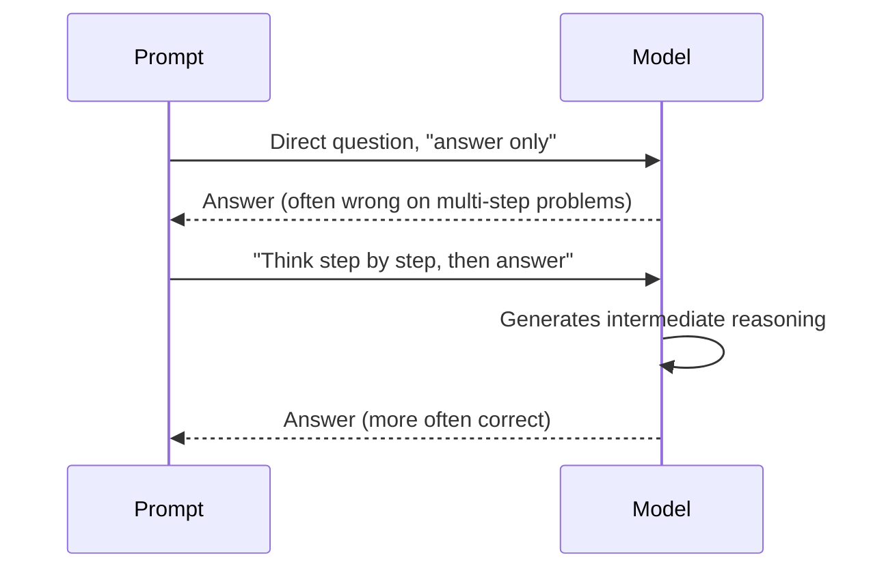
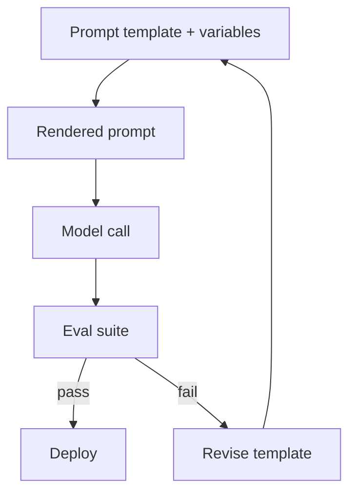

# Part III — Prompt and Context Engineering 🟡

> You'll leave this section knowing how to design prompts and manage context windows deliberately — treating the prompt as an engineered interface and the context window as a scarce, structured resource, not just "the text box."

---

## 3.1 Why prompting is an engineering discipline, not a trick

Early on, "prompt engineering" got a bad reputation — collections of magic phrases ("take a deep breath," "you are a world-class expert") that supposedly boosted quality. Some of that had a real effect on older models. On current frontier models (Claude Opus 4.8 / Sonnet 4.6, GPT-5.5, Gemini 3.1 Pro), most of that folklore has stopped mattering. What still matters, and matters more than ever as models get more capable:

- **Precision of intent** — the model can only optimize for what you actually specified, not what you meant.
- **Structure** — models parse structure (headers, XML tags, delimiters) far more reliably than they parse tone.
- **Context economy** — a 1M-token window doesn't mean you should fill it; retrieval quality degrades well before the advertised ceiling.

Think of a prompt as a **function signature** for a very capable but very literal collaborator. The discipline is in specifying inputs, constraints, and the shape of the output — not in finding a password.

```mermaid
flowchart LR
    A[Vague ask] -->|"write me a report"| B[Underspecified output]
    C[Engineered prompt] -->|role + task + constraints + format + examples| D[Predictable, checkable output]
    style A fill:#4a1a1a
    style C fill:#1a3a1a
```



> 💡 A useful test: could two different competent engineers, given only your prompt, produce meaningfully different outputs? If yes, the prompt is underspecified.

---

## 3.2 The anatomy of a well-engineered prompt

Every high-quality prompt — whether for a one-off chat message or a production system prompt — tends to decompose into the same components, in the same rough order:

| Component | Purpose | Example |
|---|---|---|
| **Role / persona** | Sets the frame the model reasons within | "You are a senior backend engineer reviewing a PR." |
| **Task** | The concrete action to perform | "Identify security issues in this diff." |
| **Context** | Facts the model needs but doesn't have | The diff itself, the repo's language/framework |
| **Constraints** | Hard boundaries on behavior or output | "Only flag issues with concrete exploit paths, not style nits." |
| **Output format** | Exact shape of the response | "Return a JSON array of `{line, severity, issue}`." |
| **Examples** | Demonstrations of the input→output mapping | One or two worked examples (few-shot) |

Not every prompt needs all six — a quick chat question doesn't need a persona — but every **production** prompt (a system prompt, an agent instruction, a reusable template) should have deliberate answers for each row, even if the answer is "not needed here."

> ⚠️ Common mistake: burying the actual instruction in the middle of a long context dump. Models — like people skimming a long email — pay the most attention to the beginning and end of a prompt. Put the task and output format near the top or bottom, not buried under three paragraphs of background.

---

## 3.3 Few-shot vs. zero-shot: when examples earn their keep

**Zero-shot** (task description only) works well when the task is common and the desired output format is unambiguous from description alone — e.g., "summarize this email in two sentences."

**Few-shot** (task description + worked examples) earns its cost when:
- The output format is unusual or has hidden conventions (a specific JSON schema, a house style)
- The task has edge cases that are easier to *show* than *describe* ("classify as spam — here's a borderline example that is NOT spam and why")
- You need consistent tone/voice across many generations

**Worked example — zero-shot failing, few-shot fixing it:**

Zero-shot prompt:
```
Extract the product name and price from this listing:
"Refurbished ThinkPad X1, mint condition, asking $340, will ship."
```
A model might return `ThinkPad X1 — $340` or a full sentence — format is unpredictable across many listings, especially messy ones.

Few-shot prompt:
```
Extract product name and price as JSON: {"product": ..., "price": ...}

Listing: "iPhone 12, cracked screen, $150 obo"
Output: {"product": "iPhone 12", "price": 150}

Listing: "Selling my old Kindle - works great, $40"
Output: {"product": "Kindle", "price": 40}

Listing: "Refurbished ThinkPad X1, mint condition, asking $340, will ship."
Output:
```
Two examples lock in both the schema and how to handle noisy language ("asking," "obo") — this generalizes far more reliably across thousands of listings than a description alone.

> 💡 Two to four examples is usually the sweet spot. More than that mostly adds token cost without adding reliability — and can start biasing the model toward superficial pattern-matching on your examples rather than the underlying task.

---

## 3.4 Chain-of-thought and structured reasoning

Asking a model to reason step-by-step before answering ("chain-of-thought," or CoT) measurably improves accuracy on multi-step tasks — arithmetic, logic, multi-hop questions, planning. The mechanism: forcing intermediate steps into the output gives the model's own generated tokens as additional "working memory" to condition on, rather than jumping straight to an answer.



Modern reasoning-tuned models (Claude with extended thinking, GPT-5.5, Gemini's "Thinking" variants) do a version of this internally and don't always need to be told — but for models without built-in extended reasoning, or for tasks where you want the reasoning **visible and auditable** (compliance, debugging), explicitly requesting a reasoning trace is still good practice.

Two patterns worth knowing by name:

- **Chain-of-thought (CoT)** — linear step-by-step reasoning toward one answer.
- **Tree-of-thought / self-consistency** — generate multiple independent reasoning paths, then pick the most consistent answer across them. Costs more tokens; earns its cost on genuinely ambiguous or high-stakes questions (e.g., "sample this reasoning 5 times, take the majority answer") rather than routine ones.

> ⚠️ Don't ask for chain-of-thought and then hide it from your evaluation — if you're grading outputs, actually read the reasoning trace sometimes. A correct final answer built on wrong reasoning is a landmine: it will fail on the next slightly-different input.

---

## 3.5 Context engineering: the window is a budget, not a bucket

By mid-2026, most frontier models ship 1M-token windows, and it's tempting to treat that as "just paste everything in." Two things push back on that:

1. **The "lost in the middle" effect.** Models retrieve information from the start and end of a long context far more reliably than from the middle. Needle-in-a-haystack and multi-needle benchmarks (RULER, MRCR v2) consistently show retrieval accuracy dropping well before the advertised ceiling, especially when multiple facts need to be combined rather than a single fact recalled.
2. **Cost and latency.** Every token in context is a token you pay for and wait for, on every turn of a multi-turn conversation, even if the model never needed 90% of it.

**Context engineering** is the discipline of deciding *what belongs in the window at all*, and in what order. The core moves:

| Technique | What it does | When to use it |
|---|---|---|
| **Retrieval over dumping** | Pull only the relevant chunks (via RAG, see Part V) instead of the whole corpus | Any corpus bigger than a few documents |
| **Summarization / compaction** | Replace old turns with a running summary | Long multi-turn agent sessions |
| **Structured context (XML/markdown)** | Wrap distinct context sources in tags so the model can tell them apart | Multiple documents, tool outputs, or conversation history in one prompt |
| **Ordering for primacy/recency** | Put the most important instructions first and last, filler in the middle | Any long prompt |
| **Context pruning** | Actively drop irrelevant tool outputs, dead-end reasoning, or stale state | Long-running agent loops |

**Worked example — structuring mixed context sources:**

```xml
<system_instructions>
You are a support-ticket triage assistant. Classify each ticket's urgency
and route it to the correct team.
</system_instructions>

<team_routing_rules>
- billing keywords -> Finance
- crash, error, 500 -> Engineering
- everything else -> General Support
</team_routing_rules>

<ticket>
Subject: App crashes on login
Body: Every time I try to log in on iOS 18 the app force-closes.
</ticket>

Classify urgency (low/medium/high) and route this ticket. Return JSON.
```

Tagging each block explicitly is cheap and dramatically reduces the model conflating instructions with data — a failure mode that gets worse, not better, as context grows.

> 💡 A good heuristic for agentic systems: if a piece of context hasn't been referenced or needed in the last several turns, it's a candidate for summarization or removal, not permanent residency in the window.

---

## 3.6 Prompt templates and versioning in production

Once a prompt leaves your playground and enters a product, it becomes a software artifact: it needs version control, testing, and rollback, exactly like code.

Practical rules that hold up in production systems:

- **Templatize, don't hardcode.** Separate the fixed instruction scaffold from the variable inputs (user message, retrieved chunks, tool results) using a templating layer (Jinja2, f-strings, or a dedicated prompt-management tool).
- **Version every prompt change.** A prompt edit is a behavior change to your system — track it in git or a prompt registry (LangSmith, PromptLayer, or your own DB table) with the same rigor as a code diff.
- **Evaluate before shipping.** Any nontrivial prompt change should run against a regression set of representative inputs before going live (see Part XVII — Evaluation).
- **Separate system prompt from user-turn instructions.** System-level rules (identity, safety, output contract) belong in the system prompt; task-specific detail belongs in the user turn. This separation makes it much easier to reuse and audit prompts across features.



---

## ✅ Checkpoint

- Can you name the six components of a well-engineered prompt and explain when each is optional?
- Why does few-shot prompting help more with format consistency than with raw task difficulty?
- What is the "lost in the middle" effect, and what are two concrete techniques to mitigate it?
- Why should a 1M-token context window change your instinct to "just paste in everything," not remove that instinct?
- What's the difference between chain-of-thought and self-consistency/tree-of-thought, and when does the extra cost of the latter pay off?

---

## 🛠️ Mini-Project

Build a small "resume screener" prompt system:

1. Write a zero-shot prompt that extracts `{name, years_experience, top_skills}` from a raw resume text blob as JSON.
2. Run it on 5 messy sample resumes (varying formats) and note where the output breaks format.
3. Convert it to a few-shot prompt with 2 worked examples covering the messiest cases you found.
4. Wrap the resume text and your extraction instructions in separate XML tags, and compare output stability across the same 5 resumes.
5. Write down, in 3 bullet points, what changed between versions 1 and 3 — this is your first informal prompt eval.

---

⬅️ Previous: [Part II — AI Engineering Fundamentals](../02-ai-engineering-fundamentals/README.md) | ➡️ Next: [Part IV — Structured Outputs and Tool Calling](../04-structured-outputs-and-tool-calling/README.md)
