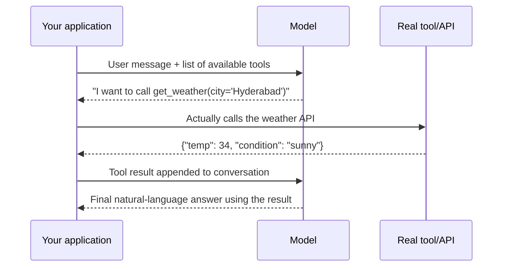
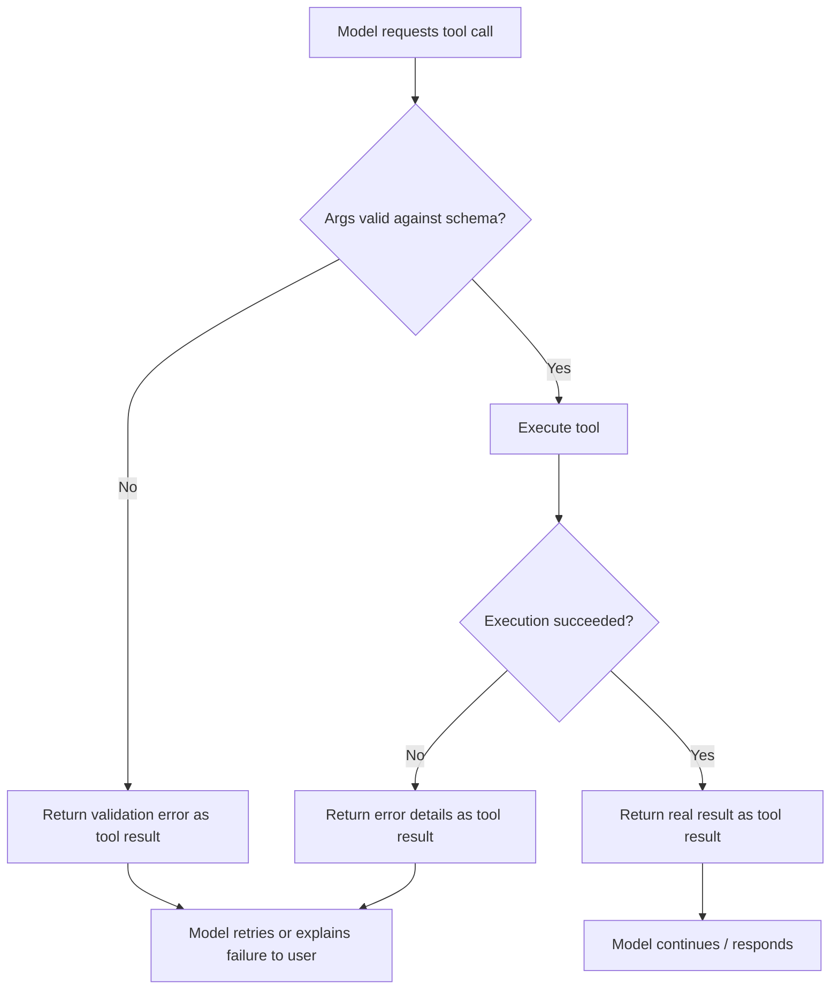

# Part IV — Structured Outputs and Tool Calling 🟡

> You'll leave this section knowing how to force a model's output into a reliable, machine-parseable shape, and how tool/function calling actually works under the hood — the two capabilities that turn a chatbot into something you can build software around.

---

## 4.1 Why "just ask nicely" isn't a strategy

Every model will happily produce JSON if you ask for it. The problem is *reliability at scale*: across ten thousand calls, some fraction will come back with a stray sentence before the JSON, a trailing comma, a missing field, or valid JSON that doesn't match your schema. Free-text prompting for structure is a suggestion, not a contract — and production systems need a contract.

There are three tiers of enforcement, from weakest to strongest guarantee:

| Tier | Mechanism | Guarantee |
|---|---|---|
| **Prompted formatting** | "Return only JSON in this shape: ..." | None — model can still deviate |
| **Schema-constrained decoding** | API-level structured output / JSON mode with a schema | Output is guaranteed valid against the schema |
| **Tool/function calling** | Model emits a structured call to a named function with typed arguments | Output is guaranteed valid against the function's parameter schema, and is semantically framed as "the model chose to invoke X" |

Most production systems should default to the strongest tier available for the job, and fall back to lighter tiers only when the API/framework doesn't support them for a given model.

> 💡 If you find yourself writing a regex to salvage malformed JSON from a model response, that's a sign you should be using schema-constrained output or tool calling instead of prompted formatting.

---

## 4.2 Schema-constrained output (structured outputs / JSON mode)

Modern frontier APIs (Anthropic's tool-use-based structured output, OpenAI's `response_format` with strict JSON schema, Gemini's structured output mode) let you pass a schema — typically JSON Schema — and have the decoding process itself constrained so the model **cannot** produce a token sequence that violates the schema. This is fundamentally different from asking nicely: it's enforced at the token-sampling level, not at the prompt level.

**Worked example — extracting structured data with a schema:**

```python
schema = {
    "type": "object",
    "properties": {
        "invoice_number": {"type": "string"},
        "total_amount": {"type": "number"},
        "line_items": {
            "type": "array",
            "items": {
                "type": "object",
                "properties": {
                    "description": {"type": "string"},
                    "quantity": {"type": "integer"},
                    "unit_price": {"type": "number"}
                },
                "required": ["description", "quantity", "unit_price"]
            }
        }
    },
    "required": ["invoice_number", "total_amount", "line_items"]
}

response = client.messages.create(
    model="claude-sonnet-4-6",
    max_tokens=1024,
    messages=[{"role": "user", "content": f"Extract invoice data:\n\n{invoice_text}"}],
    tools=[{
        "name": "record_invoice",
        "description": "Record extracted invoice data",
        "input_schema": schema
    }],
    tool_choice={"type": "tool", "name": "record_invoice"}
)
```

Notice this example uses **tool calling as the mechanism** for schema enforcement — this is the most common and most portable pattern across providers as of 2026: define a single-purpose "tool" whose only job is to shape the output, and force the model to call it.

> ⚠️ Common mistake: schemas with deeply nested optional fields and ambiguous types cause more failures, not fewer. Keep schemas as flat and explicit as the task allows — mark fields `required` deliberately, and prefer enums over free-text strings wherever the valid values are known in advance.

---

## 4.3 Tool calling: the mental model

"Tool calling" (also called function calling) is the mechanism by which a model, instead of replying with text, replies with a structured request to invoke a function you've described to it — with specific, typed arguments. Crucially: **the model never executes anything.** It only ever produces a structured description of what it *wants* called. Your application code is responsible for actually running it and returning the result.



This loop — model requests a call, application executes it, result goes back to the model, model continues — is the single most important pattern in this entire curriculum. Every agent, no matter how sophisticated, is built on top of this loop.

**Defining a good tool:**

```json
{
  "name": "get_weather",
  "description": "Get current weather conditions for a city. Use this whenever the user asks about weather, temperature, or conditions in a specific location.",
  "input_schema": {
    "type": "object",
    "properties": {
      "city": {"type": "string", "description": "City name, e.g. 'Hyderabad'"},
      "units": {"type": "string", "enum": ["celsius", "fahrenheit"], "description": "Temperature unit"}
    },
    "required": ["city"]
  }
}
```

The `description` fields are not documentation for humans — they are the **primary signal** the model uses to decide *whether* and *how* to call the tool. A vague description ("weather tool") produces worse tool-selection accuracy than a specific one that states exactly when to use it.

> 💡 Write tool descriptions the way you'd write a docstring for a new engineer who has never seen your codebase and can't ask follow-up questions. Ambiguity here is the single biggest source of wrong tool calls in production agents.

---

## 4.4 Multi-tool selection and parallel calling

Real systems expose many tools at once, and the model must choose which (if any) to call, sometimes several in parallel. A few practical patterns:

| Pattern | Description | Use when |
|---|---|---|
| **Single tool, forced** | `tool_choice` forces exactly one named tool | You want structured output only, no free-text option |
| **Auto tool choice** | Model decides whether to call a tool or respond in text | General assistant behavior |
| **Parallel tool calls** | Model requests multiple independent tool calls in one turn | Independent lookups (e.g., weather for 3 cities) that don't depend on each other's results |
| **Sequential tool calls** | Model calls one tool, sees the result, then decides the next call | Multi-step tasks where each step depends on the last (this is the core agent loop — see Part IX) |

**Worked example — why tool descriptions matter for selection, not just execution:**

Given two tools, `search_flights` and `search_hotels`, a query like *"find me something in Goa for next weekend"* is genuinely ambiguous. A well-written `search_flights` description ("Use only when the user is asking about flights, airfare, or air travel between cities") prevents the model from guessing wrong and calling it for a hotel-shaped request. This is a prompt-engineering problem wearing a tool-calling costume — the same precision principles from Part III apply directly.

> ⚠️ Common mistake: exposing 30+ tools to a model in one call "just in case." Tool selection accuracy degrades as the tool list grows and tools overlap in purpose. Curate the tool set per request/session where possible (see Part XI on MCP for how protocols solve this at scale), and keep tool names and purposes as non-overlapping as you can.

---

## 4.5 Handling tool errors and malformed calls

Tool calling fails in predictable ways, and production systems need explicit handling for each:

- **Invalid arguments** (wrong type, missing required field despite schema enforcement bugs) — validate on your application side before executing; never trust model output blindly, even schema-constrained output, for anything with real-world side effects (payments, deletions, sends).
- **Tool execution failure** (API down, rate limited, 500 error) — return the error *as a tool result*, not as an application crash. The model can often recover gracefully ("the weather API is down, here's what I can tell you without it") if it's told the truth about what happened.
- **Hallucinated tool names** — if the model asks for a tool that doesn't exist in the list you provided, it's a signal your tool descriptions overlap or your prompt didn't make the available set clear; this should never happen with a well-formed tool list, and repeated occurrences are a debugging signal, not something to silently patch around.



> 💡 Always let the model see failures. An agent that silently swallows a tool error and hallucinates a plausible-looking result is far more dangerous than one that visibly says "I couldn't check that."

---

## 4.6 Structured output vs. tool calling: choosing the right one

These two mechanisms overlap in practice (as the invoice example in 4.2 showed), but they answer different questions:

- Use **structured output** when you need *the model's entire response* to be one well-shaped object — classification, extraction, generation of a config file, form-filling.
- Use **tool calling** when you need the model to *decide whether and what to invoke* as part of a broader conversation or agentic loop, and may need to keep talking in natural language before or after.

A simple rule of thumb: if the "structure" represents a decision to act in the world (call an API, run code, send a message), model it as a tool. If it represents the shape of an answer with no external action implied, model it as constrained structured output.

---

## ✅ Checkpoint

- What is the key difference between prompted JSON formatting and schema-constrained structured output, at the mechanism level?
- Why does the model never "execute" a tool call itself — what actually happens after the model emits one?
- Why do overly generic tool descriptions hurt tool-selection accuracy more as the number of available tools grows?
- Give an example of a task better solved with structured output alone, and one better solved with tool calling.
- Why is it dangerous to let a tool execution failure disappear silently instead of being surfaced back to the model?

---

## 🛠️ Mini-Project

Build a two-tool assistant:

1. Define two tools: `convert_currency(amount, from_currency, to_currency)` (calls a real or mocked FX API) and `record_expense(amount, category, currency)` (a structured-output-only "tool" that just returns the shaped data, no external call).
2. Write tool descriptions precise enough that "I spent 50 euros on dinner, what's that in rupees?" correctly triggers `convert_currency`, while "log a $30 grocery expense" correctly triggers `record_expense`.
3. Simulate a failure in the currency API (return an error) and confirm the model surfaces it honestly instead of guessing an exchange rate.
4. Try a deliberately ambiguous query ("spent 20 on food, convert and log it") and observe whether the model makes two sequential tool calls in the right order.

---

⬅️ Previous: [Part III — Prompt and Context Engineering](../03-prompt-and-context-engineering/README.md) | ➡️ Next: [Part V — Retrieval and Grounding (RAG Basics)](../05-retrieval-and-grounding-rag-basics/README.md)
