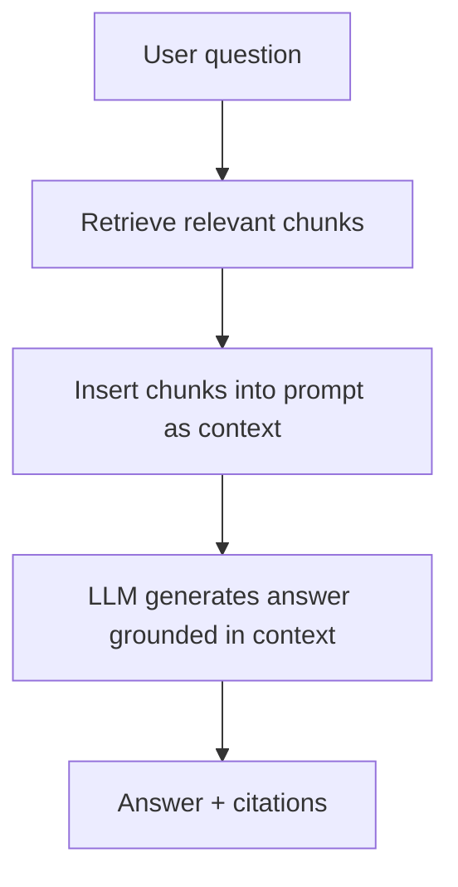
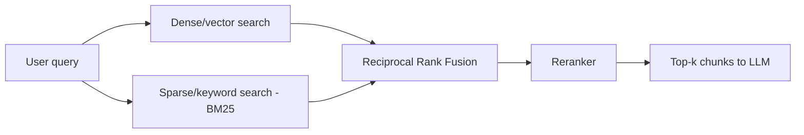

# Part V — Retrieval and Grounding: RAG Basics 🟡

> You'll leave this section knowing why RAG exists, how a retrieval pipeline actually works end to end (chunking → embedding → search → reranking → generation), when hybrid search beats pure vector search, and how to spot and fix the failure modes that make most first RAG systems disappointing.

---

## 5.1 The problem RAG solves

A model only "knows" two things: what was in its training data, and what's in the current context window. Neither covers your company's internal wiki, last week's support tickets, or a PDF the user just uploaded. **Retrieval-Augmented Generation (RAG)** closes that gap: before the model generates an answer, a retrieval step fetches relevant chunks of external text and stuffs them into the prompt as context.

This matters for three distinct reasons, and it's worth keeping them separate because they call for different design choices:

- **Freshness** — the model's knowledge is frozen at training time; your documents change daily.
- **Privacy/ownership** — you can't train a frontier model on your private data, but you can retrieve from it at inference time.
- **Grounding** — even on topics the model "knows," giving it the actual source text reduces hallucination and lets you cite where an answer came from.

> 💡 RAG is not a memory upgrade for the model — it's an open-book exam. The model still has to read and reason over what you hand it. If retrieval hands it the wrong page, no amount of reasoning ability fixes that.

---

## 5.2 The indexing pipeline: chunking and embedding

Before you can retrieve anything, you have to prepare your documents. This happens once (or on a refresh schedule), not per-query.

**Chunking** — splitting documents into retrievable pieces — is the single most underrated decision in RAG. Too large, and irrelevant text dilutes the signal and wastes context budget. Too small, and a chunk loses the surrounding context needed to make sense of it (a paragraph that says "this reduces latency by 40%" is useless if the chunk boundary cut off *what* "this" refers to).

Common strategies, roughly in order of sophistication:

| Strategy | How it works | When to use |
|---|---|---|
| Fixed-size chunking | Split every N tokens, with some overlap | Quick baseline, unstructured text |
| Recursive/structure-aware | Split on paragraph/section boundaries first, fall back to size limits | Most general-purpose documents |
| Semantic chunking | Split where embedding similarity between adjacent sentences drops | Long-form content with shifting topics |
| Document-aware (small-to-big) | Index small chunks for precision, retrieve their parent section for context | Long technical docs, legal/financial filings |

**Embedding** converts each chunk into a dense vector that captures its meaning, using an embedding model (not the same model that generates your answer — embedding models are much smaller and trained specifically for this). Chunks that mean similar things end up close together in vector space, which is what makes semantic search possible.

> ⚠️ Common mistake: chunking by a fixed token count with no overlap and no regard for structure, then being surprised retrieval quality is mediocre. Spend real time here — it has more leverage on final answer quality than almost any other RAG decision, including which LLM you use to generate the answer.

---

## 5.3 Retrieval: vector search, keyword search, and hybrid

**Vector (dense) search** embeds the user's query the same way as the chunks, then finds the nearest chunks in vector space (usually via cosine similarity), typically served by a vector database (Pinecone, Weaviate, Qdrant, pgvector, or a library like FAISS). It's excellent at matching *meaning* even when wording differs — "how do I cancel my plan" retrieves a doc titled "subscription termination."

**Keyword (sparse) search**, classically BM25, matches exact terms and term frequency. It's excellent at things vector search is surprisingly bad at: exact product codes, error messages, acronyms, and rare proper nouns that an embedding model may not represent precisely.

**Hybrid search** runs both and merges the ranked lists — commonly via **Reciprocal Rank Fusion (RRF)**, which combines rankings without needing the two systems' scores to be on the same scale. In practice, hybrid retrieval consistently outperforms either method alone, because dense and sparse search fail on different query types.

| Approach | Strong at | Weak at |
|---|---|---|
| Dense/vector | Paraphrase, synonyms, conceptual matches | Exact codes, rare terms, numbers |
| Sparse/BM25 | Exact terms, codes, acronyms, names | Synonyms, conceptual similarity |
| Hybrid (RRF) | Both of the above | Slightly more infra to run and tune |

---

## 5.4 Reranking: a second, more expensive pass

Vector and keyword search are fast but approximate — they're built to filter millions of chunks down to a shortlist quickly, not to perfectly rank that shortlist. A **reranker** (typically a cross-encoder model that looks at the query and each candidate chunk *together*, rather than comparing pre-computed vectors) re-scores the top 20–100 candidates and reorders them. This second pass is slower per-item but only runs on a small shortlist, so it's cheap in aggregate and meaningfully improves precision at the top of the list — the positions that actually make it into the LLM's context.

**Worked example — a support bot over product docs:**

1. User asks: *"Why does my export fail with error 4092?"*
2. Hybrid search over 50,000 chunked doc pages returns 40 candidates — BM25 catches the exact "4092" match, vector search catches conceptually related "export failure" troubleshooting pages.
3. A reranker scores all 40 against the literal query and promotes the one chunk that specifically documents error 4092, even though it wasn't the top hit from either individual search method.
4. The top 3–5 reranked chunks go into the prompt, and the model answers with a citation back to the doc page.

> 💡 If you can only add one improvement to a mediocre RAG system, add a reranker before you touch anything else — it's usually the highest return on effort of any single change.

---

## 5.5 Assembling the prompt and generating the answer

Once you have your top-k chunks, how you hand them to the model matters:

- **Cite sources explicitly** in the prompt structure (e.g., number each chunk, and instruct the model to cite `[1]`, `[2]` in its answer) so users can verify claims.
- **Instruct the model to say "I don't know"** when retrieved context doesn't answer the question — without this instruction, models tend to fall back on parametric (training-data) knowledge, which defeats the purpose of grounding.
- **Order matters**: some models pay more attention to content at the start and end of a long context than the middle — put the most relevant chunk first, not buried in the middle of ten others.
- **Don't over-stuff context.** More retrieved chunks isn't always better; irrelevant chunks can distract the model and even get cited as if relevant. Tune top-k empirically rather than maximizing it.

---

## 5.6 Evaluating a RAG system

RAG has two separate failure surfaces, and you have to measure them separately or you won't know which one to fix:

| Layer | What can go wrong | How to measure |
|---|---|---|
| Retrieval | The right chunk was never fetched | Recall@k, MRR (mean reciprocal rank) against a labeled query/answer-chunk set |
| Generation | The right chunk was fetched but the model ignored it, misread it, or hallucinated anyway | Answer correctness/faithfulness, often via LLM-as-judge scoring against the retrieved context |

> ⚠️ Common mistake: only eyeballing final answers. If an answer is wrong, you need to know whether retrieval failed (wrong chunk, or no chunk) or generation failed (right chunk, wrong answer) — they have completely different fixes. Build a small labeled eval set (even 30–50 question/answer/source-doc triples) before you start tuning anything.

---

## ✅ Checkpoint

- Why does chunk size affect answer quality more than most people expect?
- What specific failure mode does hybrid search fix that pure vector search can't?
- Why does a reranker improve results even though the retriever already returned "relevant" candidates?
- When retrieval and generation can each fail independently, why does that matter for how you evaluate a RAG system?
- What's the difference between grounding a model's answer and expanding its knowledge?

---

## 🛠️ Mini-Project

1. Take 10–15 pages of a real document (product docs, a PDF manual, your own notes) and chunk it two ways: fixed-size (500 tokens, no overlap) and structure-aware (split on headings/paragraphs).
2. Embed both chunk sets and build a simple vector search over each (a local FAISS index or a hosted vector DB's free tier both work).
3. Write 8–10 realistic questions a user would actually ask, and record whether each chunking strategy retrieves the chunk that actually contains the answer.
4. Add a simple keyword (BM25) search over the same documents and compare which questions it answers that vector search missed, and vice versa.

---

⬅️ Previous: [Part IV — Structured Outputs and Tool Calling](../04-structured-outputs-and-tool-calling/README.md) | ➡️ Next: [Part VI — Open-Source Models](../06-open-source-models/README.md)
