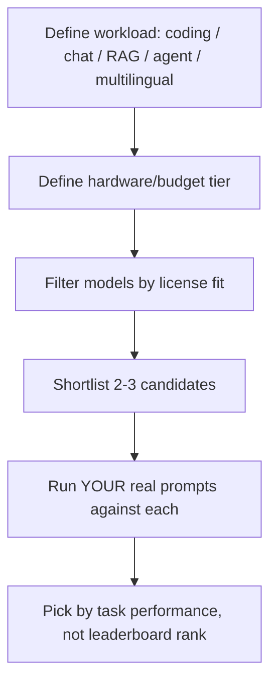

# Part VI — Open-Source Models 🟡

> You'll leave this section knowing how the open-weight model landscape is organized, how to actually read a license instead of skimming it, and how to pick an open model for a real workload instead of chasing leaderboard rankings.

---

## 6.1 "Open-source" vs. "open-weight" — a distinction that matters

The phrase "open-source LLM" is almost always a misnomer, and the imprecision has real legal consequences. A genuinely open-source model would ship weights, training code, and training data under an open license. Almost nothing at the frontier does this:

| Term | What's actually released | Example |
|---|---|---|
| **Open-weight** | Model weights only, usable/fine-tunable, training data/pipeline undisclosed | Llama 4, Qwen 3.5, Gemma 4, most "open" frontier models |
| **Open-source (true)** | Weights + training code + training data, all under an open license | Rare at frontier scale; more common for smaller research models |
| **Weights-available, API-only for larger variants** | Some sizes in a family are open-weight, flagship sizes are closed | Qwen has flipped some of its largest variants API-only while keeping mid-size weights open |

> ⚠️ Common mistake: assuming "the weights are on Hugging Face" means "I can do anything with this model commercially." Read the actual license text, not the marketing page. Availability and permission are different questions.

---

## 6.2 The 2026 landscape at a glance

The gap between open-weight and closed frontier models has narrowed dramatically — several open models now match or beat proprietary flagships on specific benchmarks (coding, math) while trailing on general knowledge breadth and polish. The landscape is dominated by a handful of families, each with a distinct identity:

| Family | Maker | Strength | License |
|---|---|---|---|
| **DeepSeek (V4 / R1 line)** | DeepSeek | Cost-efficiency, strong coding/math, aggressive MoE architectures | MIT — most permissive |
| **Qwen (3.x)** | Alibaba | Broad multilingual coverage, strong general reasoning, large ecosystem of fine-tunes | Apache 2.0 |
| **Llama 4** | Meta | Long context (Scout variant), huge community tooling | Custom Meta license — usage cap and geographic restrictions apply |
| **Gemma 4** | Google | Efficient small/mid sizes, strong for edge and on-device | Apache 2.0 |
| **GLM (5.x)** | Zhipu / Z.ai | Coding and long-horizon agentic tasks | MIT |
| **Mistral (Large 3 / Small 4)** | Mistral AI | European data sovereignty, strong multilingual, agentic function calling | Apache 2.0 |
| **Phi-4** | Microsoft | Small, fast, on-device/edge use | MIT |

Almost every current flagship open model is a **sparse Mixture-of-Experts (MoE)** architecture: a large total parameter count, but only a fraction "active" per token (e.g., a ~1T-parameter model with ~30–50B active parameters). This is why parameter counts alone are misleading for hardware planning — active parameters, not total parameters, drive inference compute cost.

```mermaid
flowchart LR
    A[Input token] --> B{Router}
    B --> C[Expert 1]
    B --> D[Expert 2]
    B --> E[... Expert N]
    C --> F[Combine outputs]
    D --> F
    E --> F
    F --> G[Output]
    style B fill:#2a2a4a
```

> 💡 When comparing "400B" and "70B" open models, always check active parameters, not just total. A 400B MoE model with 17B active can be cheaper to serve than a 70B dense model, despite the larger headline number.

---

## 6.3 Reading a license like an engineer, not a marketer

License terms are the single most consequential — and most skipped — part of choosing an open model for production. Three things to check every time:

1. **Usage caps.** Some licenses (notably Meta's Llama license) restrict companies above a monthly-active-user threshold from using the model without a separate commercial agreement. If your product might cross that line, this isn't a footnote — it's a legal blocker.
2. **Geographic restrictions.** Certain licenses carve out specific jurisdictions from permitted use.
3. **Field-of-use and non-commercial clauses.** Some research-oriented releases (and some smaller labs' models) are CC-BY-NC or similarly restricted — fine for prototyping, not for a commercial product.

| License | Typical terms | Practical implication |
|---|---|---|
| **MIT** | No restrictions beyond attribution | Safest for any commercial use |
| **Apache 2.0** | Permissive, includes patent grant | Safest for any commercial use, slightly more legal protection than MIT |
| **Custom vendor license (e.g., Llama 4)** | Usage caps, geographic carve-outs | Get legal review before scaling past stated thresholds |
| **CC-BY-NC** | Non-commercial only | Prototyping/research only, not shippable products |

> ⚠️ "Get legal review" is not a throwaway line here — it's the actual correct next step before any open model with a non-MIT/Apache license goes into a revenue-generating product.

---

## 6.4 Choosing a model: a decision framework, not a leaderboard

Benchmark leaderboards change monthly and are easy to over-index on. A more durable framework starts from your constraints, not the model's score:

Practical starting points by task, as of mid-2026:

- **General-purpose chat / assistant** — Qwen 3.5 or Llama 4 Maverick are strong defaults with broad ecosystem support.
- **Coding and agentic tool-use** — GLM-5.x and DeepSeek's coder-tuned variants consistently lead open-weight coding benchmarks.
- **Edge / on-device / cost-constrained** — Gemma 4 (smaller variants) or Phi-4-mini; both are designed to run on modest hardware with minimal quality loss.
- **Long-context workloads** — Llama 4 Scout's advertised context is unmatched among open models, though (as with all long-context claims) verify effective retrieval at your actual document lengths rather than trusting the headline number.
- **Regulated / data-sovereignty-sensitive deployments** — Mistral's models are the primary open option built and governed within the EU, which matters when data residency is a compliance requirement, not a preference.

> 💡 Run a small, real evaluation (20–50 examples from your actual use case) across your shortlist before committing. A model that wins a general benchmark can still underperform a "weaker" model on your specific domain and prompt style.

---

## 6.5 Fine-tunability and the ecosystem effect

A model's raw capability is only part of the decision — the surrounding ecosystem matters just as much in practice:

- **Community fine-tunes and quantizations.** Popular open-weight families (Qwen, Llama, DeepSeek) accumulate thousands of derivative checkpoints on Hugging Face — domain-specific fine-tunes, quantized variants for smaller hardware, merged models. A less popular model with better raw benchmarks can be a worse practical choice if you'll need to fine-tune or quantize it and no tooling exists yet.
- **Framework support.** Check that your intended serving stack (vLLM, SGLang, TensorRT-LLM — see Part VII) has day-one or near-day-one support for the model's architecture, especially for newer MoE designs with novel attention mechanisms.
- **License clarity for derivatives.** If you plan to fine-tune and redistribute, confirm the license explicitly covers fine-tuned derivatives, not just the base weights.

> ⚠️ Common mistake: picking the model with the best benchmark score in an announcement blog post, then discovering three weeks later that your serving framework doesn't support its attention mechanism yet, or that no quantized build exists at the size your hardware needs. Verify tooling maturity before committing, not after.

---

## 6.6 Open vs. closed: when each one wins

This isn't a permanent verdict — it's a live tradeoff that shifts as both sides improve:

| Dimension | Open-weight advantage | Closed-model advantage |
|---|---|---|
| **Data sovereignty** | Full control, on-prem deployment possible | Data leaves your infrastructure |
| **Cost at high volume** | Can be far cheaper self-hosted past a break-even token volume | Cheaper at low volume (no infra to run) |
| **Customization** | Full fine-tuning, weight access | Limited to prompting/light fine-tuning APIs |
| **General knowledge breadth & polish** | Closing gap, but still often behind | Typically ahead, especially on nuanced instruction-following |
| **Operational simplicity** | You own uptime, scaling, security patching | Provider owns all of that |

A reasonable rule of thumb: below roughly tens of millions of tokens per month, API pricing on a closed or hosted-open model usually beats the cost of standing up your own GPU infrastructure once you account for engineering time. Self-hosting starts paying for itself at meaningfully higher volume, or when sovereignty/compliance requirements make it non-optional regardless of cost.

---

## ✅ Checkpoint

- What's the practical difference between "open-source" and "open-weight," and why does it matter legally?
- Why can a 400B-parameter MoE model be cheaper to serve than a 70B dense model?
- Name two things you must check in a model's license before shipping it in a commercial product.
- What's wrong with choosing an open model purely from a leaderboard ranking, without running your own evaluation?
- At what point does self-hosting an open-weight model typically start being more cost-effective than API access?

---

## 🛠️ Mini-Project

1. Pick a task you care about (e.g., extracting structured data from customer emails, or writing SQL from natural language).
2. Shortlist three open-weight models from different families (e.g., one Qwen, one Llama, one DeepSeek variant) available through a hosted inference provider (OpenRouter, Together, Fireworks) or locally via Ollama.
3. Run the same 15 real examples from your task through all three, using identical prompts.
4. Score each on accuracy and note latency/cost per request.
5. Separately, look up the actual license for your winning model and write two sentences on whether it's safe to ship commercially at your (hypothetical) scale.

---

⬅️ Previous: [Part V — Retrieval and Grounding (RAG Basics)](../05-retrieval-and-grounding-rag-basics/README.md) | ➡️ Next: [Part VII — Model Serving and Local Inference](../07-model-serving-and-local-inference/README.md)
