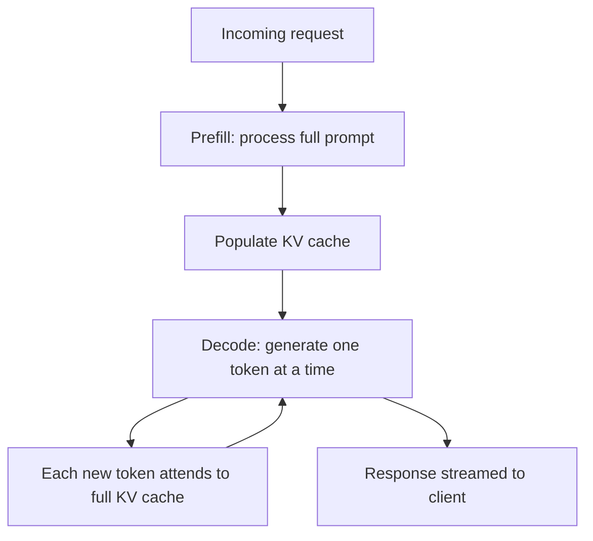
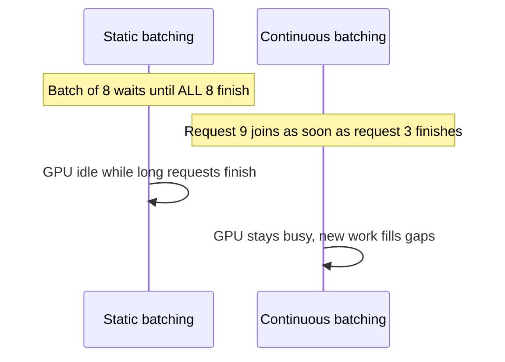
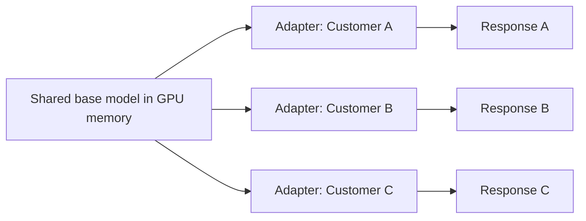

# Part VII — Model Serving and Local Inference 🔴

> You'll leave this section knowing how LLM inference actually gets served at scale — the memory bottlenecks that shape every serving framework's design, how to choose between vLLM, SGLang, and simpler local tools, and how quantization trades quality for footprint.

---

## 7.1 Why serving an LLM is a memory problem before it's a compute problem

Training gets the headlines, but *serving* is where most engineering hours in a production AI system actually go. The central bottleneck isn't raw FLOPs — it's **GPU memory**, for one structural reason: the KV cache.

When a model generates tokens one at a time, it doesn't recompute attention over the entire prompt from scratch at every step — it caches the key/value tensors from prior tokens (the "KV cache") and reuses them. This cache grows linearly with sequence length and batch size, and for long-context requests, it can dwarf the memory used by the model's weights themselves.

This is why naive serving (loading a model in a plain PyTorch script and calling `.generate()`) falls apart under real traffic: memory fragments, batches can't be packed efficiently, and throughput collapses well before you hit the theoretical compute ceiling. Every serious serving framework exists to solve this memory-management problem.

> 💡 The two numbers that actually predict your serving cost and latency are **active parameters** (compute per token) and **KV cache size at your typical sequence length** (memory pressure) — not total parameter count.

---

## 7.2 The core innovation: PagedAttention and continuous batching

**vLLM**, the framework that popularized modern high-throughput serving, introduced **PagedAttention** — managing the KV cache in fixed-size, non-contiguous "pages" the way an operating system manages virtual memory, instead of requiring one large contiguous memory block per request. This eliminates most memory fragmentation and lets many more concurrent requests fit in the same GPU memory.

The second key idea, **continuous batching**, replaces static batching (waiting for a fixed batch of requests, running them together, waiting for the whole batch to finish) with a scheduler that adds new requests into a running batch as soon as GPU capacity frees up — dramatically improving GPU utilization under real, uneven traffic patterns.

Both ideas are now standard across serving frameworks, not unique to any one tool — but they're the reason production serving requires dedicated infrastructure rather than a script.

---

## 7.3 Choosing a serving framework

| Framework | Best for | Notes |
|---|---|---|
| **vLLM** | Default choice for most teams | Widest model support, strong documentation, no compilation step, competitive throughput out of the box |
| **SGLang** | Structured-output-heavy workloads, multi-LoRA at scale | Overlaps constrained-decoding overhead with inference, so JSON-schema/tool-calling workloads keep throughput that guided decoding otherwise costs elsewhere; strong native multi-adapter batching |
| **TensorRT-LLM** | Maximum raw throughput on NVIDIA hardware | Requires a compilation/build step per model; best when you're locked into one model and want peak performance |
| **Hugging Face TGI** | Teams already standardized on the HF ecosystem | Strong integration with HF Hub, streaming, broad model coverage |
| **Ollama / llama.cpp** | Local development, prototyping, single-user/edge deployment | Not designed for high-concurrency production serving — optimized for ease of use, not throughput |

A practical decision path: **start with vLLM** for anything general-purpose. Move to **SGLang** specifically if your workload leans heavily on structured outputs or tool calling and you've measured a real throughput penalty with guided decoding elsewhere. Reach for **TensorRT-LLM** only when you've settled on a fixed model and need to squeeze out the last increment of throughput, given its compilation overhead. Use **Ollama** for local development and personal/edge tools, not for serving concurrent production traffic.

> ⚠️ Common mistake: prototyping on Ollama, confirming the model behaves well, then trying to scale the exact same setup to handle real user traffic. Ollama is built for single-user convenience, not multi-tenant throughput — plan the migration to a production serving framework as a distinct step, not an afterthought.

---

## 7.4 Quantization: trading precision for footprint

Model weights are typically trained in 16-bit floating point (FP16/BF16). **Quantization** reduces the numerical precision of weights (and sometimes activations) to shrink memory footprint and increase throughput, at some cost to output quality.

| Quantization level | Typical memory reduction | Quality impact |
|---|---|---|
| **FP16 / BF16** (baseline) | — | None (reference quality) |
| **INT8** | ~2x smaller | Usually minimal, measurable on some tasks |
| **INT4 (e.g., Q4_K_M, AWQ, GPTQ)** | ~4x smaller | Noticeable on some benchmarks, often acceptable for chat/general tasks |
| **FP8** (native on newer GPUs) | ~2x smaller | Increasingly used in production for frontier-scale MoE models with minimal measured loss |

**Worked example — why this matters for hardware planning:** A 70B-parameter dense model in FP16 needs roughly 140GB of GPU memory just for weights (2 bytes per parameter), before accounting for KV cache — meaning it doesn't fit on a single 80GB GPU. Quantized to INT4 (roughly 0.5 bytes per parameter), the same model fits comfortably on a single 80GB card with substantial headroom for KV cache and concurrent requests. This is often the difference between "needs a multi-GPU cluster" and "runs on one card."

> 💡 Always benchmark quantized models on *your* task before assuming quality loss is acceptable. Aggregate benchmark scores can look fine while specific failure modes (numerical precision in extracted data, subtle instruction-following) get meaningfully worse — this matters most for structured extraction and agentic tool-calling tasks, less for casual chat.

---

## 7.5 Serving multiple fine-tuned variants: the multi-LoRA pattern

A common production need: many customers or use cases, each wanting a slightly customized model, but you don't want to host a full separate copy of a 70B+ model per customer. **LoRA (Low-Rank Adaptation)** fine-tuning (covered in depth in Part VIII) produces small "adapter" weights layered on top of a shared frozen base model — often tens of megabytes instead of tens of gigabytes.

Modern serving frameworks support loading many LoRA adapters simultaneously against one base model in GPU memory, and dynamically routing each incoming request to the correct adapter — batching requests for *different* adapters together where possible.

This pattern is the practical foundation of most "custom AI for each customer" SaaS products: one base model deployment, many lightweight adapters, dramatically lower infrastructure cost than one full model per tenant.

> ⚠️ Multi-LoRA serving has real limits — dozens of adapters on one base model is routine, but hundreds with heterogeneous traffic patterns starts to stress scheduling and memory, and framework choice (SGLang's native multi-adapter batching vs. vLLM's support) starts to matter at that scale.

---

## 7.6 Local inference: when and why to run models on your own hardware

"Local inference" ranges from a laptop running a small quantized model for personal use, to an enterprise cluster running a self-hosted 400B-parameter model for data-sovereignty reasons. The decision drivers are consistent regardless of scale:

- **Data never leaves the boundary you control** — the primary driver for regulated industries and privacy-sensitive applications.
- **No per-token API cost** — attractive once volume is high enough to amortize hardware/ops cost (see Part VI's break-even discussion).
- **Latency control** — no network round-trip to an external API, useful for real-time or offline-capable applications.
- **Operational cost** — you now own GPU provisioning, scaling, monitoring, and security patching, which is nontrivial engineering work that a hosted API abstracts away entirely.

**Practical hardware tiers (mid-2026):**

| Tier | Hardware | What fits |
|---|---|---|
| Laptop / edge | 8–16GB RAM, no dedicated GPU | Quantized 1–4B models via Ollama/llama.cpp |
| Single workstation GPU | 24GB VRAM (e.g., RTX 4090) | Quantized 8–30B models |
| Single datacenter GPU | 80GB (H100/H200) | 70B-class models quantized, or smaller MoE models at full precision |
| Multi-GPU cluster | 4–8x H100/H200 | Frontier-scale MoE models (400B+) at production concurrency |

> 💡 Don't default to the biggest model your hardware can technically run. Start with the smallest model that clears your quality bar on real task samples — a smaller model that fits comfortably with headroom for concurrency will usually serve more real traffic, more reliably, than a larger model running at the edge of its memory limit.

---

## ✅ Checkpoint

- Why is GPU memory, not raw compute, usually the binding constraint in LLM serving?
- What problem does PagedAttention solve, and what problem does continuous batching solve — are these the same thing?
- When would you choose SGLang over vLLM, specifically?
- Roughly how much does INT4 quantization reduce memory footprint compared to FP16, and what's the tradeoff?
- Why does multi-LoRA serving make "one custom model per customer" economically viable?

---

## 🛠️ Mini-Project

1. Install Ollama locally and pull two models of different sizes (e.g., a ~3B and a ~8B model).
2. Send the same 10 prompts to both and record response latency and, subjectively, quality.
3. Pull a quantized (e.g., Q4) and, if available, a less-quantized build of the same model; compare output quality on 5 prompts that require precise instruction-following (not casual chat) — a structured-extraction or arithmetic task works well here.
4. Write up, in a short table, your own "quality vs. footprint" tradeoff observation — this is the same judgment call production teams make at a much larger scale.

---

⬅️ Previous: [Part VI — Open-Source Models](../06-open-source-models/README.md) | ➡️ Next: [Part VIII — Fine-Tuning](../08-fine-tuning/README.md)
