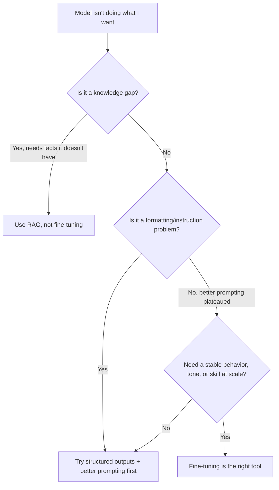
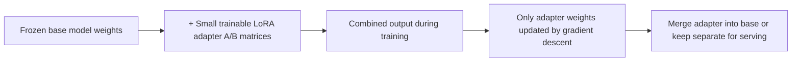

# Part VIII — Fine-Tuning 🟡

> You'll leave this section knowing when fine-tuning is actually the right tool (and when it isn't), how LoRA and QLoRA make it affordable on a single consumer GPU, what a real training dataset looks like, and how to run and evaluate a fine-tune without fooling yourself about whether it worked.

---

## 8.1 Fine-tuning is usually the wrong first move

Before touching any training code, run this decision through in order — most "we need to fine-tune" conversations end after step one or two:



Fine-tuning changes the model's *weights* — it's suited to teaching a stable behavior, tone, output format, or narrow skill (like reliable tool-calling in a fixed schema) that you want baked in, not retrieved on demand. It is **not** a substitute for RAG when the problem is "the model doesn't know X fact" — updating weights to memorize facts is expensive, doesn't update cleanly, and a fine-tuned model still can't cite its source. It's also usually not the fix for a formatting problem that better prompting or structured-output constraints (Part IV) could solve for free.

> 💡 Rule of thumb: reach for fine-tuning only after prompt engineering has genuinely plateaued and the task has enough structure that a few hundred to a few thousand examples can actually define it — style, tone, classification, structured extraction, and reliable tool-use are good fits; "make it know our product catalog" is not.

---

## 8.2 LoRA and QLoRA: how fine-tuning got affordable

Full fine-tuning updates every parameter in a model — for a 70B model, that means optimizer states and gradients on top of 140GB of FP16 weights, well beyond a single high-end GPU. **LoRA (Low-Rank Adaptation)** changed the economics: instead of updating the full weight matrices, it freezes the base model and inserts small trainable "adapter" matrices alongside each targeted layer, training only those. Only roughly 1% of the model's parameters actually get updated, but that's typically enough to teach a stable new behavior.

**QLoRA** goes further by keeping the frozen base model quantized to 4-bit precision (NF4) while training the LoRA adapters in higher precision on top. This is now the default starting point for most fine-tuning work: it cuts memory requirements roughly in half again versus standard LoRA, with only a small (roughly 1–2%) quality cost on most tasks.



| Method | What's frozen | What's trained | Typical VRAM for a 70B model |
|---|---|---|---|
| Full fine-tuning | Nothing | All parameters | 300GB+ (multi-GPU cluster) |
| LoRA | Base weights (16-bit) | Small adapter matrices | ~140GB+ (still large, but no optimizer states on full model) |
| QLoRA | Base weights (4-bit quantized) | Small adapter matrices (16-bit) | ~40–48GB (fits on a single 80GB GPU, or dual consumer GPUs) |

> 💡 A related technique, **DoRA** (Weight-Decomposed LoRA), decomposes the weight update into magnitude and direction and applies LoRA to the direction only — it often converges faster and closer to full fine-tuning quality at the same rank. Most current frameworks support it as a one-flag opt-in and it's a reasonable default upgrade over plain LoRA.

---

## 8.3 Choosing your toolchain

| Tool | Best for | Notes |
|---|---|---|
| **Unsloth** | Single-GPU speed, fastest path to a working fine-tune | Custom kernels roughly 2x faster and using significantly less VRAM than a standard LoRA pipeline; the default choice for solo devs and quick iteration |
| **Axolotl** | YAML-configured, reproducible pipelines; multi-GPU production | Wider training-objective support (SFT, DPO, ORPO, GRPO, full fine-tuning) and cleaner multi-GPU scaling; slower per-GPU than Unsloth on a single card |
| **Hugging Face TRL** | Full control of the training loop, preference optimization (RLHF-style) work | Unifies SFTTrainer, DPOTrainer, KTOTrainer, ORPOTrainer, RewardTrainer under one library |
| **LlamaFactory** | Teams that want a web UI instead of code/YAML | Good for non-specialists who need to run a fine-tune without writing a training script |

A practical path: **start with Unsloth** on a single GPU (a free Colab/Kaggle GPU handles 7B-class models comfortably) to validate that fine-tuning is even worth it for your task. **Move to Axolotl** once you need multi-GPU scale or a training objective beyond plain supervised fine-tuning, like preference optimization.

---

## 8.4 Building your training dataset

Dataset quality is the single biggest lever on fine-tune quality — bigger than model choice, bigger than hyperparameters. The standard format is JSONL with a chat-style schema:

```json
{"messages": [
  {"role": "system", "content": "You are a specialized support assistant for CloudSync."},
  {"role": "user", "content": "My sync keeps failing with error 4092."},
  {"role": "assistant", "content": "Error 4092 means your local cache is out of sync with the server index. Run `cloudsync repair --cache` and retry."}
]}
```

Key points that matter more than most people expect:

- **Only the assistant's response contributes to the training loss** — the system and user turns are masked so the model learns to *generate* good outputs, not to predict its own inputs. Every major framework does this automatically when you use the chat/messages format.
- **Use the target model's actual chat template.** Training with the wrong special tokens (Llama's template on a Qwen base model, for instance) silently degrades quality.
- **Quality beats quantity, decisively.** A few hundred hand-curated examples reliably outperform a few thousand scraped or synthetically generated ones.

| Dataset size | Typical use case |
|---|---|
| 200–1,000 examples | Style, tone, or format adaptation |
| 1,000–5,000 examples | Domain specialization (terminology, workflows, structured extraction) |
| 5,000–50,000+ examples | Broader capability or instruction-tuning changes |

> ⚠️ Common mistake: mixing in zero general-purpose instruction data and fine-tuning only on narrow domain examples for many epochs. This causes **catastrophic forgetting** — the model gets great at your task and noticeably worse at everything else. Mixing in 5–10% general instruction data, and keeping epoch count low (1–3) for datasets under 1,000 examples, largely prevents this.

---

## 8.5 Running and evaluating the fine-tune

A minimal QLoRA setup with Unsloth looks like this:

```python
from unsloth import FastLanguageModel

model, tokenizer = FastLanguageModel.from_pretrained(
    model_name="unsloth/Meta-Llama-3.1-8B-Instruct",
    max_seq_length=2048,
    load_in_4bit=True,   # enables QLoRA
)

model = FastLanguageModel.get_peft_model(
    model,
    r=16,
    target_modules=["q_proj","k_proj","v_proj","o_proj","gate_proj","up_proj","down_proj"],
    lora_alpha=16,
    lora_dropout=0,
    use_gradient_checkpointing="unsloth",
)
# ... then hand `model` and your dataset to an SFTTrainer
```

Two hyperparameter notes worth internalizing: target **all linear layers**, not just query/value projections — the extra VRAM cost is small and the quality gain is consistent — and prefer `lora_alpha = r` as a starting point rather than the older `alpha = 2r` convention.

**Evaluate on your actual target metric, not training loss.** A fine-tune with beautifully decreasing loss that doesn't move the metric you care about (task accuracy, format compliance, a held-out eval set) failed, full stop. Watch for the classic overfitting signature — training loss near zero while validation loss climbs — and respond by reducing epochs, adding dropout, or expanding the dataset rather than training longer.

> ⚠️ Common mistake: evaluating only by "vibes" on a handful of prompts you already know the answer to. Hold out a labeled validation set *before* training and never let the model see it, the same discipline you'd apply to any ML system.

---

## ✅ Checkpoint

- Why is "the model doesn't know our product catalog" usually a RAG problem, not a fine-tuning problem?
- What does LoRA actually train, and why does that make it dramatically cheaper than full fine-tuning?
- What specific problem does QLoRA solve on top of standard LoRA, and what's the tradeoff?
- Why does dataset quality matter more than dataset size?
- What's catastrophic forgetting, and what's the cheapest way to prevent it?

---

## 🛠️ Mini-Project

1. Pick a narrow, well-defined task (e.g., converting freeform customer emails into a fixed JSON schema, or matching a specific writing tone).
2. Hand-write 150–300 example input/output pairs in the chat JSONL format shown above — resist the urge to generate them all synthetically.
3. Fine-tune a small open-weight model (7–8B) with QLoRA via Unsloth on a free-tier GPU (Colab or Kaggle).
4. Compare the fine-tuned model against the base model on 15 held-out examples it never saw during training, scoring both for task accuracy and for whether general capability (a couple of unrelated prompts) held up.

---

⬅️ Previous: [Part VII — Model Serving and Local Inference](../07-model-serving-and-local-inference/README.md) | ➡️ Next: [Part IX — Understanding Agents](../09-understanding-agents/README.md)
