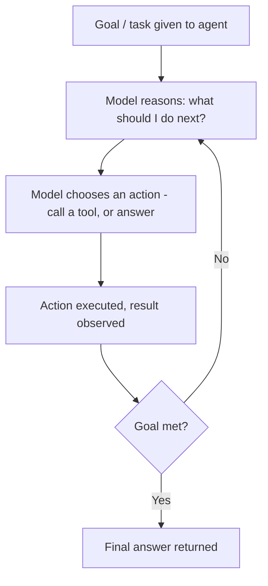
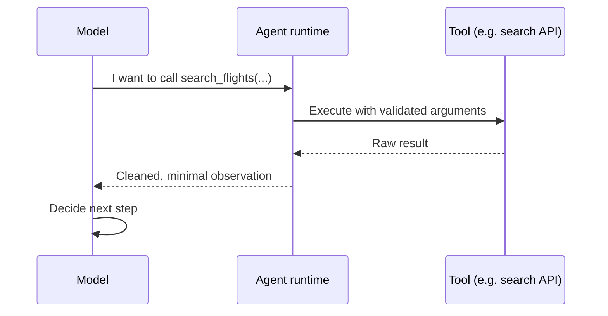
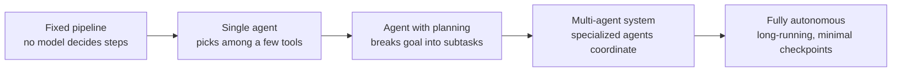

# Part IX — Understanding Agents 🟡

> You'll leave this section knowing what actually separates an "agent" from a chatbot with tools, how the plan → act → observe loop works under the hood, what memory and autonomy really mean in this context, and how to decide when an agent is the right architecture versus overkill.

---

## 9.1 What makes something an agent

A standard LLM call is a single request/response: you send a prompt, you get text back. An **agent** is a system where the model doesn't just respond — it reasons about a goal, decides what to do next, takes an action (usually calling a tool), observes the result, and decides again, in a loop, until the goal is met or it gives up.

The distinction that matters in practice: with a plain LLM call, *you* decide the sequence of steps and call the model at each one. With an agent, *the model* decides the sequence of steps, and your code just executes what it asks for and feeds the result back. You're handing over control flow, not just text generation.

> 💡 The simplest possible mental model: a plain LLM call answers a question. An agent completes a project — and a project usually takes more than one step, some of which you can't fully predict in advance.

---

## 9.2 The reasoning loop: ReAct and its variants

The dominant pattern behind most agent implementations is **ReAct** (Reason + Act): at each step, the model produces a short reasoning trace ("I need the current weather before I can answer this"), then an action (a tool call), then receives an observation (the tool's output), and repeats. This loop is what every agent framework — LangGraph, CrewAI, the OpenAI Agents SDK, the Claude Agent SDK — implements under different abstractions; the loop itself is not unique to any one tool.

| Step | What happens | Example |
|---|---|---|
| Reason | Model thinks about what's needed next | "I don't know today's exchange rate, I should look it up" |
| Act | Model emits a structured tool call | `get_exchange_rate(from="USD", to="EUR")` |
| Observe | Tool result is fed back into context | `{"rate": 0.92}` |
| Reason again | Model decides if it has enough to answer, or needs another step | "I have the rate, I can now compute the total" |

This loop terminates when the model decides it has enough information to produce a final answer — or, in a well-built system, when a **step limit or timeout** is hit, which you should always set. An agent without a hard ceiling on steps can loop indefinitely on a task it's stuck on, silently burning tokens and money.

> ⚠️ Common mistake: shipping an agent with no maximum step count or timeout. The failure mode isn't dramatic — it's a quiet, expensive loop that keeps calling tools and re-reasoning without making progress, and the first sign is usually the bill, not an error message.

---

## 9.3 Tools: how agents actually do things

A **tool** is a function the model can call — described to it with a name, a description, and a schema for its inputs — that does something outside the model itself: search the web, query a database, call an API, write a file, run code. The model doesn't execute the tool; it emits a structured request to call it, your code executes it, and the result is handed back as an observation.

Tool design is one of the highest-leverage, most underrated parts of building a reliable agent:

- **Narrow, well-named tools beat one giant do-everything tool.** `search_flights(origin, destination, date)` is easier for the model to use correctly than a generic `call_api(endpoint, params)`.
- **Descriptions are part of the prompt.** The model chooses tools based on their descriptions, so vague or overlapping descriptions cause it to pick the wrong one.
- **Return structured, minimal observations.** Dumping an entire raw API response back into context wastes tokens and buries the signal the model actually needs.

---

## 9.4 Memory: what an agent remembers, and for how long

"Memory" in agent systems is really several different things layered together, and conflating them is a common source of confusion:

| Memory type | What it holds | Lifespan |
|---|---|---|
| Context window | The current conversation and recent tool observations | This single run/session |
| Short-term scratchpad | Intermediate reasoning and partial results within a multi-step task | This task, discarded after |
| Long-term memory | Facts, preferences, or past interactions persisted across sessions | Across sessions — stored externally (a database, vector store, or key-value store) |
| Retrieved knowledge (RAG) | Domain documents fetched to ground a specific answer | Retrieved fresh per query, not "remembered" by the model at all |

Most confusion here comes from treating the context window as if it were memory. It isn't — it's finite, it resets between sessions unless you deliberately persist something outside it, and anything you want an agent to "recall" tomorrow has to be written somewhere durable today.

> 💡 Long-term memory for an agent is really just RAG pointed at a different corpus — the agent's own history — rather than a separate mechanism. If you understand Part V, you already understand most of how agent memory works.

---

## 9.5 Autonomy is a spectrum, not a switch

"Agent" gets used to describe everything from a single tool-calling loop with three fixed tools to a fully autonomous multi-day research system with no human checkpoints. It's more useful to think of autonomy as a dial:

Higher autonomy isn't strictly "better" — it trades predictability and debuggability for flexibility. A fixed pipeline is easier to test, monitor, and reason about than a system where the model chooses its own path every time. The right point on this dial depends on how well-defined your task is and how costly a wrong action would be.

> ⚠️ Common mistake: reaching for a fully autonomous multi-agent system when a fixed three-step pipeline would solve the actual problem. The most common failure in early agent projects is over-engineering the orchestration layer before confirming the underlying model can reliably do the task at all with a single tool-calling loop.

---

## 9.6 When to use an agent (and when not to)

| Signal | Suggests |
|---|---|
| The steps are known and fixed in advance | A regular pipeline/workflow — you don't need an agent |
| The right sequence of steps depends on what earlier steps return | An agent — the model needs to decide dynamically |
| A wrong action is costly or hard to undo (sending an email, deleting data) | Keep a human-in-the-loop checkpoint regardless of autonomy level |
| The task can be done in one LLM call with good prompting | Don't build an agent — you're adding complexity for no benefit |

> 💡 Ask "does the next step depend on information I don't have until the current step finishes?" If yes, you likely need an agent. If you can write out the fixed sequence of steps today, you almost certainly don't.

---

## ✅ Checkpoint

- What's the actual difference between a single LLM call and an agent — not in marketing terms, but in terms of who controls the sequence of steps?
- Walk through one full iteration of the ReAct loop in your own words.
- Why is a step limit or timeout non-negotiable for any agent you ship?
- Why is a context window not the same thing as memory?
- Given a task, how would you decide where it sits on the autonomy spectrum?

---

## 🛠️ Mini-Project

1. Pick a small multi-step task (e.g., "given a city name, tell me if I should bring an umbrella tomorrow" — requiring a geocoding lookup, then a weather lookup, then a judgment call).
2. Write out, in plain English, what the ReAct loop should look like for this task: what does the model reason at each step, what tool does it call, what observation comes back.
3. Without using any framework yet, simulate the loop by hand: make the two API calls yourself in the order the model would choose, and write the final reasoning step that turns the weather data into a yes/no answer.
4. Note where a step limit would need to kick in if, say, the geocoding lookup failed — what should the agent do instead of retrying forever?

---

⬅️ Previous: [Part VIII — Fine-Tuning](../08-fine-tuning/README.md) | ➡️ Next: [Part X — Building Your First Agents](../10-building-your-first-agents/README.md)
