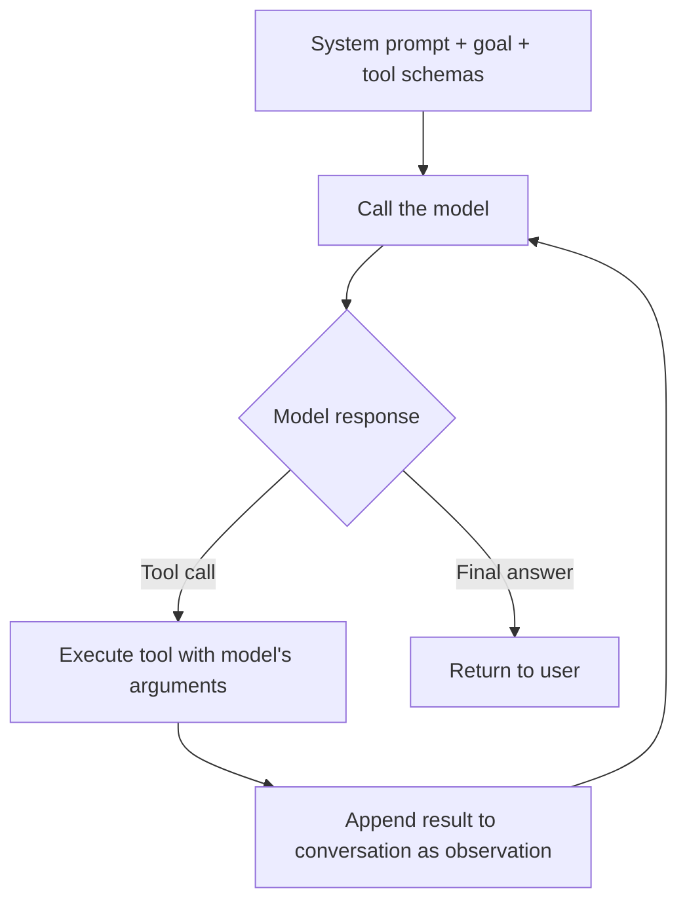
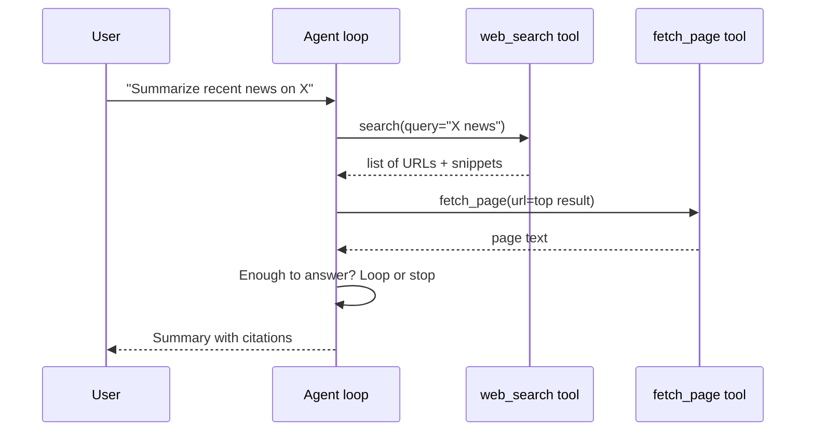

# Part X — Building Your First Agents 🟡

> You'll leave this section knowing how to build a working agent from scratch with raw API calls before reaching for a framework, which framework fits which situation, and the concrete debugging habits that separate agents that work from agents that quietly fail.

---

## 10.1 Build the loop by hand first

It's tempting to jump straight to a framework, but building one simple agent from raw API calls first pays off — it makes every abstraction a framework adds later legible instead of magic. The whole loop is: give the model a goal and a list of tools, let it choose one, run it, feed the result back, repeat.



A minimal version, using the Anthropic Messages API directly:

```python
import anthropic

client = anthropic.Anthropic()

tools = [{
    "name": "get_weather",
    "description": "Get current weather for a city",
    "input_schema": {
        "type": "object",
        "properties": {"city": {"type": "string"}},
        "required": ["city"]
    }
}]

messages = [{"role": "user", "content": "Should I bring an umbrella in Austin tomorrow?"}]

for _ in range(5):  # hard step limit
    response = client.messages.create(
        model="claude-sonnet-4-6",
        max_tokens=1024,
        tools=tools,
        messages=messages,
    )
    if response.stop_reason != "tool_use":
        print(response.content[0].text)
        break

    tool_call = next(b for b in response.content if b.type == "tool_use")
    result = call_real_weather_api(tool_call.input["city"])  # your own function

    messages.append({"role": "assistant", "content": response.content})
    messages.append({"role": "user", "content": [
        {"type": "tool_result", "tool_use_id": tool_call.id, "content": str(result)}
    ]})
```

Notice the hard step limit (`for _ in range(5)`) — this is the single most important line in the file, and it's the first thing beginners forget.

> 💡 If you can't build this loop by hand in under 50 lines, a framework won't fix that — it'll just hide the part you don't understand yet behind a class name.

---

## 10.2 Choosing a framework once you outgrow raw loops

You outgrow the hand-rolled loop fast: multi-agent coordination, durable state across steps, human-in-the-loop approval, and observability all get painful to build yourself. This is where a framework earns its keep. A practical, current snapshot of the landscape:

| Framework | Mental model | Best for | Tradeoff |
|---|---|---|---|
| **LangGraph** | Explicit state graph — nodes are work, edges are transitions | Production systems needing durable state, checkpointing, human-in-the-loop, audit trails | Steepest learning curve of the mainstream options |
| **CrewAI** | Role-based "crew" of agents with tasks and delegation | Fast prototyping of workflows that map to human team roles (researcher → writer → editor) | Coarser error handling; less fine-grained control at scale |
| **AutoGen / AG2** | Agents converse with each other to reach an answer | Offline, quality-sensitive work where multiple perspectives should debate (code review, research synthesis) | Higher latency/token cost — a multi-round debate is many full LLM calls |
| **Vendor SDKs** (OpenAI Agents SDK, Claude Agent SDK, Google ADK) | Thin, opinionated wrapper around one vendor's tool-use loop | A single agent calling one or two tools, fastest path to shipping | Locked to that vendor's models |

A practical decision path: **start with a vendor SDK or a hand-rolled loop** for a single agent with a handful of tools — it's the lowest-overhead path to something working. **Move to CrewAI** if the work naturally splits into specialist roles and you want to prototype fast without learning a graph abstraction. **Move to LangGraph** once you need durable execution, precise control over branching/retries, or a human approval step in a production system. Reach for **AutoGen/AG2** specifically when the value is agents debating or reviewing each other's work, not just executing a pipeline.

> ⚠️ Common mistake: picking a framework because it's trending, then discovering the abstraction fights the shape of your actual problem. CrewAI's role-based model is a poor fit for a workflow that needs fine-grained conditional branching; LangGraph's explicit graph is more machinery than a two-tool prototype needs. Match the framework's mental model to your task's shape, not the other way around.

---

## 10.3 A concrete first project: a research-summary agent

Let's build a slightly larger example: an agent that takes a topic, searches the web, and produces a short cited summary — using two tools and a clear stopping condition.



The tool descriptions here matter as much as the code:

```python
tools = [
    {
        "name": "web_search",
        "description": "Search the web for recent, general information on a topic. Returns titles, URLs, and short snippets — not full page text.",
        "input_schema": {"type": "object", "properties": {"query": {"type": "string"}}, "required": ["query"]}
    },
    {
        "name": "fetch_page",
        "description": "Fetch the full text of a specific URL, only after web_search has identified it as relevant.",
        "input_schema": {"type": "object", "properties": {"url": {"type": "string"}}, "required": ["url"]}
    }
]
```

Notice the second tool's description explicitly tells the model *when* to use it relative to the first — this kind of sequencing hint, written directly into the tool description, measurably reduces the model calling `fetch_page` on a guessed URL instead of a real search result.

> 💡 Give the model a maximum of one or two `fetch_page` calls per search in your system prompt. Without a nudge, agents often over-fetch — pulling in far more page text than the summary needs and burning context budget on it.

---

## 10.4 Debugging agents: what actually goes wrong

Agent failures look different from normal software bugs — the failure mode is usually "the model made a reasonable-sounding but wrong decision," not a stack trace. A few habits catch most real-world issues:

| Symptom | Likely cause | Fix |
|---|---|---|
| Agent loops without making progress | No clear stopping signal, or a tool keeps returning something the model can't act on | Add explicit stop conditions; check tool output is actually useful, not just non-empty |
| Wrong tool chosen repeatedly | Overlapping or vague tool descriptions | Rewrite descriptions to be mutually exclusive and specific about when to use each |
| Agent "hallucinates" a tool result | A tool call failed silently and the model filled the gap | Never let a tool fail silently — return explicit errors as observations so the model can react to them |
| Runs fine on your test prompt, breaks on real traffic | Tested on a narrow, friendly set of inputs | Build a small adversarial/edge-case test set (ambiguous requests, missing info) before shipping |

**Always log the full trace** — every reasoning step, tool call, and observation — not just the final answer. Every framework provides some form of this (LangSmith for LangGraph, built-in tracing for CrewAI and the vendor SDKs); use it. Debugging an agent from the final answer alone is like debugging a program from its stdout with no stack trace.

> ⚠️ Common mistake: testing an agent only on the happy path you designed it for. The most valuable 30 minutes you can spend before shipping is deliberately trying to break it — ambiguous instructions, a tool that returns an error, a question outside its scope — and watching what it does.

---

## ✅ Checkpoint

- Why build the agent loop by hand before reaching for a framework, even though you'll likely end up using one?
- What's the concrete failure mode of an agent with no step limit, and why is it often invisible until the bill arrives?
- Given a task, how would you decide between a vendor SDK, CrewAI, and LangGraph?
- Why do vague or overlapping tool descriptions cause real failures, not just cosmetic ones?
- Why is logging the full reasoning/tool-call trace non-negotiable for debugging an agent?

---

## 🛠️ Mini-Project

1. Build the hand-rolled weather-umbrella agent (or a variant of your choice) from section 10.1 with a real API for at least one tool.
2. Add a second tool that could plausibly be confused with the first, and write tool descriptions specific enough that the model reliably picks the right one across 10 varied test prompts.
3. Deliberately break something — make a tool return an error, or ask a question the tools can't answer — and observe what the agent does. Fix it so it degrades gracefully (says "I can't determine that" instead of guessing).
4. Log every step of 5 full runs and review the trace: were there any turns where the model's reasoning didn't actually match the action it took?

---

⬅️ Previous: [Part IX — Understanding Agents](../09-understanding-agents/README.md) | ➡️ Next: [Part XI — MCP (Model Context Protocol)](../11-mcp-model-context-protocol/README.md)
